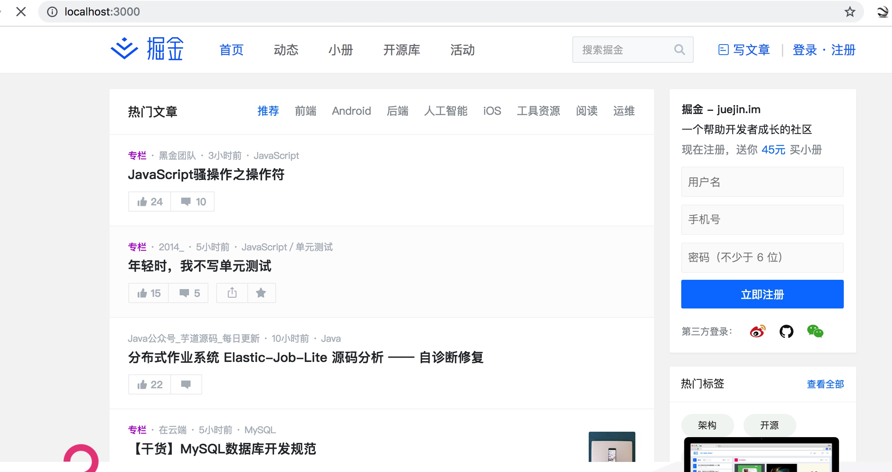
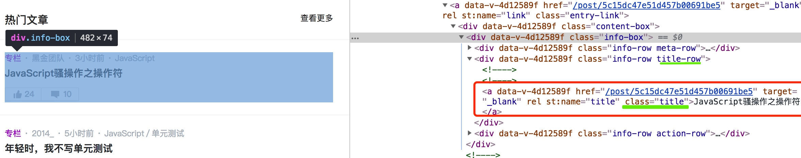
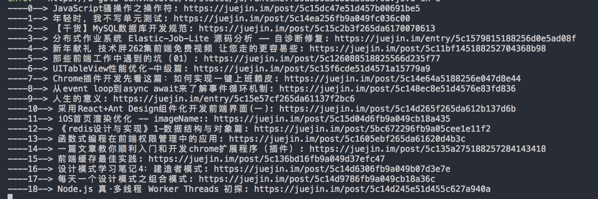

### koa2 + phantom + cheerio 实现入门级爬虫
- [phantom使用](http://amirraminfar.com/phantomjs-node/#/phantom_obj?id=logger)
- [cheerio使用](https://cheerio.js.org/)

1. 创建项目目录，然后使用 `npm init` 初始化项目目录。
2. 安装项目所需要的依赖包 `koa2` `koa-router` `phantom` `cheerio`

    ```
    npm install koa2 koa-router phantom cheerio --save
    ```
3. 创建一个 `app.js` 文件，写入：
```javascript
    const Koa = require('koa2')
    const router = require('koa-router')
    const phantom = require('phantom')
    const cheerio = require('cheerio')
    
    const app = new Koa() // koa实例
    const router = new Router() // router实例
    
    router.get('/', async (ctx) => {
        const url = 'https://juejin.im/timeline/frontend' // 爬取掘金
        const instance = await phantom.create()
        const page = await instance.createPage()
        const status = await page.open(url)
        await page.on('onResourceRequested', (req) => {
            console.log(req.url) // 拿到页面请求的url
        })
        const content = await page.property('content')
        console.log(content) // 拿到整个页面的dom结构
        ctx.body = content
        await instance.exit()
    })
    
    app
      .use(router.routes())
      .use(router.allowedMethods())
    
    app.listen(3000, () => {
      console.log(`listen server in port 3000`)
    })
```
4. 启动 `node`， `node app.js`，在浏览器打来可以看到掘金首页了，说明已经能够爬取到掘金的页面数据


5. 我们使用 `cheerio` 将掘金的首页文章标题和链接爬取出来：
 > 分析页面结构：我们发现掘金的每个标题和链接都在 `title-row`下的 `title`里面，那我们就很好操作了 
 
 
修改代码：
```javascript
router.get('/', async (ctx) => {
        const url = 'https://juejin.im/timeline/frontend' // 爬取掘金
        const instance = await phantom.create()
        const page = await instance.createPage()
        const status = await page.open(url)
        await page.on('onResourceRequested', (req) => {
            console.log(req.url) // 拿到页面请求的url
        })
        const content = await page.property('content') // 拿到整个页面的dom结构
        // cheerio不会用的看上面的使用教程链接
        const $ = cheerio.load(content, {
          decodeEntities: false
        })
        $('.title-row .title').each((index, element) => {
            console.log(`----${index}-->`, `${element.children[0].data}: https://juejin.im${element.attribs.href}`)
        })
        ctx.body = content
        await instance.exit()
    })
```
##### 再次运行node，我们查看控制台的打印：


#### 结尾
这种方法是针对要爬取的页面的dom结构做分析，从而拿到自己想要的数据，还可以分析页面的请求url，模拟页面请求，从而爬取页面接口返回的数据，不过接口一般都有做反爬取，所以要具体分析。