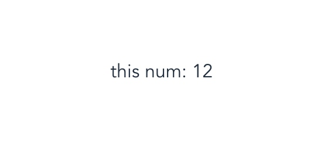

### vuex 使用
 - 安装
 
 ```
 npm install vuex --save
 ```
 - 引入
 ```javascript
 import Vuex from 'vuex'
 import Vue from 'vue'
 Vue.use(Vuex)
 ```
 - 使用
 ```javascript
 const store = new Vuex({
     state: {}, // Vuex store 实例的根 state 对象, 想象成vue data 
     mutations: {}, // 存放操作 state 内参数的方法，必须是同步方法
     actions: {}, // 存放操作 state 内参数的方法，可以异步操作
     getters: {}, // 可以认为是 store 的计算属性
     modules: {}, // 将 store 分割成模块, 各自维护本身的 state、mutations、actions ……
     plugins: [], // 插件
     strict: Boolean, // 是否启动严格模式
     devtools: Boolean // 为某个特定的 Vuex 实例打开或关闭 devtools
 })
 // 实例化vue
 new Vue({
     el: '#app',
     store,
     ...options
 })
 ```
 
#### 推荐项目结构
```
├── index.html
├── main.js
├── api
│   └── ... # 抽取出API请求
├── components
│   ├── App.vue
│   └── ...
└── store
    ├── index.js          # 我们组装模块并导出 store 的地方
    ├── actions.js        # 根级别的 action
    ├── mutations.js      # 根级别的 mutation
    └── modules
        ├── cart.js       # 购物车模块
        └── products.js   # 产品模块
```
 
#### state
 >`vuex` 的 `state` 你可以想象成是 `vuex` 的 `data` 属性，里面都是预先定义好的一些变量，让后通过 `mutations` 或者 `actions` 里面定义的方法去改变它.

- 页面取值
 > 可以通过 `store.state.[key]` 来在页面中取的存储在state中的值
   `vue` 单文件组件中可以通过 `this.$store.state.[key]`来读取

- mapState 辅助函数
    >当一个组件需要获取多个状态时候，将这些状态都声明为计算属性会有些重复和冗余。为了解决这个问题，我们可以使用 mapState 辅助函数帮助我们生成计算属性
    
    ```javascript
    import { mapState } from 'vuex'
    
    export default {
      // ...
      computed: mapState({
        // 箭头函数可使代码更简练
        count: state => state.count,
    
        // 传字符串参数 'count' 等同于 `state => state.count`
        countAlias: 'count',
    
        // 为了能够使用 `this` 获取局部状态，必须使用常规函数
        countPlusLocalState (state) {
          return state.count + this.localCount
        }
      })
    }
    ```
- 实例
    ```javascript
    // index.js
    const store = new Vuex({
        state: {
            count: 12
        }
    })
    ```
    
    ```html
    // home.vue
    <template>
      <div class='home'>
        this num: {{num}}
      </div>
    </template>
    
    <script>
    import { mapState } from 'vuex'
    export default {
      mounted () {
         // 通过 this.$store.state.[key] 取值
        console.log(this.$store.state.count) // 12
      },
      computed: mapState({ // mapState 辅助函数
        num: 'count'
      }),
    }
    </script>
    ```

---



---


#### mutations
 >mutations 你可以把它想象是 vue 中的 methods 属性，里面存放操作 state 的一些方法，【注意】mutations 只能存放同步的方法，有异步操作的请放入 actions 中。
 
<p style="color: #55b9b4">
1.每个 mutation 都有一个字符串的 事件类型 (type) 和 一个 回调函数 (handler)。
</p>
<p style="color: #55b9b4">
2.回调函数接受 state 作为第一个参数, 其余参数可以作为调用时候的传参 
</p>

```javascript
const store = new Vuex.Store({
  state: {
    count: 1
  },
  mutations: {
    add (state) {
      // 变更状态
      state.count++
    },
  }
})
```

<p style="color: #55b9b4">
可以使用常亮代替 mutations 事件类型，同时把这些常量放在单独的文件中可以让你的代码合作者对整个 app 包含的 mutation 一目了然
</p>
```javascript
// mutation-types.js
export const SOME_MUTATION = 'SOME_MUTATION'
```
```javascript
import Vuex from 'vuex'
import { SOME_MUTATION } from './mutation-types'
    
const store = new Vuex.Store({
  state: { ... },
  mutations: {
    // 我们可以使用 ES2015 风格的计算属性命名功能来使用一个常量作为函数名
    [SOME_MUTATION] (state) {
      // mutate state
    }
  }
})
```
    
    
- 实例
    
```javascript
//index.js
import Vuex from 'vuex'
import Vue from 'vue'
Vue.use(Vuex)
const store = new Vuex.Store({
  state: {
    count: 12,
    value: 'hello'
  },
  mutations: {
    add (state) {
      state.count++
    },
    change (state, data) {
      state.value = data
    }
  }
})
```
    
```html
<template>
  <div class='home'>
    <p>this num: {{num}}</p>
    <p>this value: {{val}}</p>
    <button @click="add">+</button>
    <button @click="change">change</button>
  </div>
</template>
<script>
import {mapState} from 'vuex'
export default {
  computed: mapState({
    num: 'count',
    val: 'value'
  }),
  methods: {
    add () {
      this.$store.commit('add')
    },
    change () {
      this.$store.commit('change', 'longzhou')
    }
  }
}
</script>
```
---


---

### actions

>Action 类似于 mutation，不同在于：
1.Action 提交的是 mutation，而不是直接变更状态。
2.Action 可以包含任意异步操作。
```javascript
const store = new Vuex.Store({
  state: {
    count: 0
  },
  mutations: {
    increment (state) {
      state.count++
    }
  },
  actions: {
    increment (context) {
      context.commit('increment')
    }
  }
})
```
Action 函数接受一个与 store 实例具有相同方法和属性的 context 对象，因此你可以调用 context.commit 提交一个 mutation，或者通过 context.state 和 context.getters 来获取 state 和 getters。

- 调用
Action 通过 `store.dispatch` 方法触发：

```javascript
store.dispatch('increment')
```
<br/>
<br/>
<br/>
<br/>

…… 未完，待续。。。
    