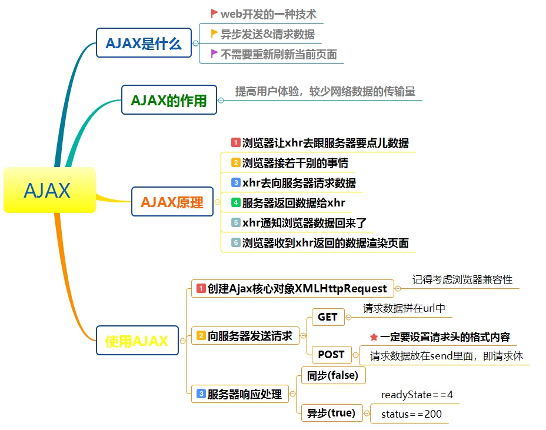

#### http: get和post的区别，为什么用get不用post？
1. get请求在回退浏览器是无害的，post会重新提交一次请求
2. get请求会被浏览器主动缓存，post除非手动去设置
3. get请求，参数是拼接在url上的，所以没有post请求安全
4. GET参数通过URL传递，POST放在Request body中
5. get请求传递的参数有长度限制，部分浏览器中是2k，部分服务器也会忽略长于规定的参数。post没有限制
6. GET请求参数会被完整保留在浏览器历史记录里，而POST中的参数不会被保留。
7. 部分浏览器在设计的时候，GET产生一个TCP数据包；POST产生两个TCP数据包，对于GET方式的请求，浏览器会把http header和data一并发送出去，服务器响应200（返回数据）；而对于POST，浏览器先发送header，服务器响应100 continue，浏览器再发送data，服务器响应200 ok（返回数据）(Firefox的post只发送一次)。

#### vue/react 中的 diff 算法，深比较和浅比较？


#### 基本类型和引用类型有什么区别？
- 基本类型： `null、undefined、boolean、string、number、symbol`
- 引用类型： `Array、Function、Object`
基本类型的值存入栈内存（先进后出），引用类型的地址存取栈内存，引用类型的值存入堆内存

#### Ajax的原理是什么
通过`XmlHttpRequest`对象来向服务器发异步请求，从服务器获得数据，然后用javascript来操作DOM而更新页面.(网上一搜全是说 XmlHttpRequest，我也不知道这答案对不对，反正我觉得不对)



#### 事件委托
利用js事件冒泡的特性，将事件监听绑定在父层元素上，从而可以通过在子元素上绑定id或者data-id等签名判断点击。
- 为什么要事件委托？
1. 绑定事件越多，浏览器内存占用越大，严重影响性能，部分浏览器移除元素时，绑定的事件并没有被及时移除，导致的内存泄漏，严重影响性能
2. ajax的出现，局部刷新的盛行，导致每次加载完，都要重新绑定事件
3. 大部分ajax局部刷新的，只是显示的数据，而操作却是大部分相同的，重复绑定，会导致代码的耦合性过大，严重影响后期的维护。

#### e.target与e.currentTarget的区别
- MDN中对target的解释为，一个触发事件的对象的引用， 当事件处理程序在事件的冒泡或捕获阶段被调用时。
- 而对于currentTarget，它指的是当事件遍历DOM时，标识事件的当前目标。它总是引用事件处理程序附加到的元素，而不是event.target，它标识事件发生的元素。

####  判断变量类型
1. `typeof` 对于基本类型，除了 `null` 都可以显示正确的类型, `typeof` 对于对象，除了函数都会显示 `object`
    ```javascript
      typeof 1           // 'number'
      typeof '1'         // 'string'
      typeof undefined   // 'undefined'
      typeof true        // 'boolean'
      typeof Symbol()    // 'symbol'
      typeof b           // b 没有声明，但是还会显示 undefined
    ``` 
 2. `instanceof` 可以正确的判断对象的类型，因为内部机制是通过判断对象的原型链中是不是能找到类型的 `prototype`
    ```javascript
      // 最重要的是可以分辨 数组 和 对象
      let arr = []
      let obj = {}
      arr instanceof Array   // true
      obj instanceof Array   // false
    ```
3. `Object.prototype.toString.call()` 我们就可以获得类似 [object Type] 的字符串。
    ```javascript
      let arr = []
      let obj = {}
      Object.prototype.toString.call(arr) // [Object, Array]
      Object.prototype.toString.call(obj) // [Object, Object]
      
#### css里面哪些属性会有GPU加速
- transform: translateZ(0);
- transform: translate3d(0,0,0);
- transform-style:preserve-3d;
- backface-visiblity:hidden;
[坑]('https://div.io/topic/1348')
[介绍文章]('https://www.jianshu.com/p/02340582324d')

#### Flex布局的理解
[阮一峰：flex布局]('http://www.ruanyifeng.com/blog/2015/07/flex-grammar.html')

#### 谈谈Promise和回调函数的区别
讲讲promise的用法，讲讲事件循环，promise.resolve()放入微任务

#### es6 里面的 class 和 function有什么区别


#### BFC

####  new 运算符的执行过程
- 新生成一个对象
- 链接到原型: obj.__proto__ = Con.prototype
- 绑定this: apply
- 返回新对象(如果构造函数有自己 retrun 时，则返回该值)

