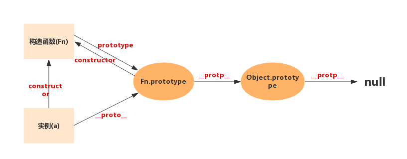

###  判断变量类型
1. `typeof` 对于基本类型，除了 `null` 都可以显示正确的类型, `typeof` 对于对象，除了函数都会显示 `object`
    ```javascript
      typeof 1           // 'number'
      typeof '1'         // 'string'
      typeof undefined   // 'undefined'
      typeof true        // 'boolean'
      typeof Symbol()    // 'symbol'
      typeof b           // b 没有声明，但是还会显示 undefined
    ``` 
 2. `instanceof` 可以正确的判断对象的类型，因为内部机制是通过判断对象的原型链中是不是能找到类型的 `prototype`
    ```javascript
      // 最重要的是可以分辨 数组 和 对象
      let arr = []
      let obj = {}
      arr instanceof Array   // true
      obj instanceof Array   // false
    ```
3. `Object.prototype.toString.call()` 我们就可以获得类似 [object Type] 的字符串。
    ```javascript
      let arr = []
      let obj = {}
      Object.prototype.toString.call(arr) // [Object, Array]
      Object.prototype.toString.call(obj) // [Object, Object]
    ```

### javeScript原型和原型链
  看下图基本能懂
  


### this指针问题
  <a href="./notes/this指针总结.md">this指针总结</a>

### 箭头函数this指针问题
  函数体内的this对象，就是定义时所在的对象，而不是使用时所在的对象
  ```javascript
    var a = 1

    let foo = () => console.log('------>', this.a)

    let bar = function () {
      console.log('------>', this.a)
    }

    let obj = {a: 2}  

    foo.call(obj)  // 1
    bar.call(obj)  // 2
  ```

### koa2 中间件执行机制 —— 洋葱模型

```javascript
  app.use(async (ctx, next) => {
    console.log('这是第 1 步执行')
    await next()

    console.log('这是第 5 步执行')
  })

  app.use(async (ctx, next) => {
    console.log('这是第 2 步执行')
    await next()

    console.log('这是第 4 步执行')
  })


  router.get('/home', async (ctx) => {
    console.log('这是第 3 步执行')
  })
```

### vue生命周期问题
   [vue生命周期](./notes/vue生命周期.md)